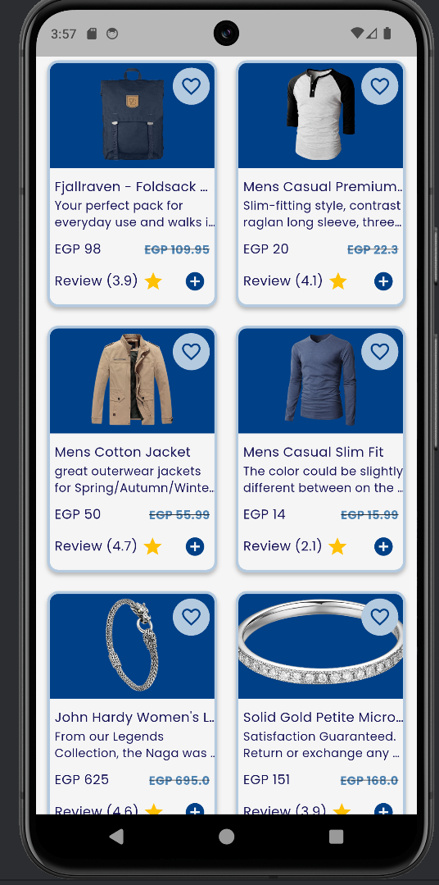
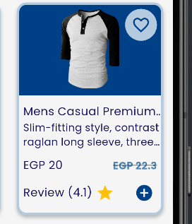

# Shopping Screen

A simple Flutter Screen that displays a grid of products with prices, reviews, favorite buttons, and
add-to-cart functionality.
The app is responsive and works well across different screen sizes.

## ✨ Features

- 📱 Responsive grid layout using GridView.builder
- 🛒 Product cards with:
    - Product image
    - Title & description
    - Price with discount display
    - Review rating with stars
    - Favorite (wishlist) button
    - Add-to-cart button

- State management with Cubit - Provider (for favorites & products fetching)

- 🔄 Fetch products dynamically (from API or repository layer)

## 📸 Screenshots
<table>
  <tr>
    <td></td>
    <td></td>
  </tr>
</table>

## 📂 Project Structure (MVVM + Clean Code Inspired)

```bash 
lib/
│── core/                # Core utilities (constants, theme, utils)
│── features/
│   └── shopping/
│       ├── data/        # Models, repositories
│       ├── presentation/
│       │   ├── cubit/   # Cubit/Bloc classes
│       │   ├── screens/ # Screens
│       │   └── widgets/ # Reusable widgets (ProductCard, etc.)
│── main.dart            # Entry point
```
